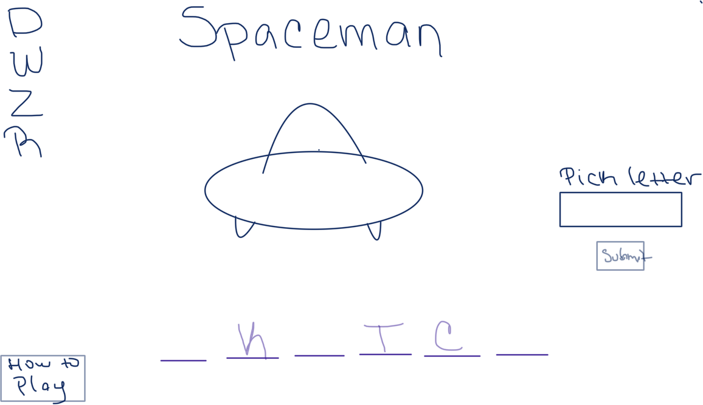
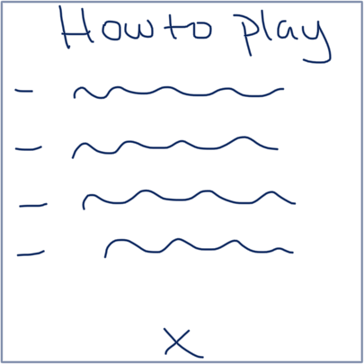

# Spaceman Game 

## Project Description 

A browser-based Spaceman two-player game. A user, player 1, will input a word to be guessed by their opponent, player 2, at the start of the game. The word is represented by blank spaces for each letter on the page, which are revealed when guessed. For wrong guesses, a part of the spaceship is revealed. If player 2 guesses the word before the spaceship is completely built, they win. If not, player 1 wins. 

## Technologies
This project utilizes HTML, CSS, and vanilla Javascript

## Installation 
Fork this repo to your account. Clone it to your machine. Run Live Server from the index.html file.

## Wire Frames

## Difficulties
A hurdle I faced while building this project was the logic to display all of the letters in the word when a correct guess was made. I initially tried .indexOf(), which only returned the first index. Then I tried adding on .lastIndexOf, and adding both to an array to iterate through and display the letters at that index. Unfortunately, this only gave me the first and last index of the correctly guessed letters. After some internet searching, I came across an article that displayed a function to find all of the indices. After applying the function to my code, I was able to identify all indices related to correct guesses. 

https://www.tutorialspoint.com/find-and-return-array-positions-of-multiple-values-javascript

## User Stories

### MVP Goals

- As a user, I want a browser-based interface, so that I can play the game
- As a user, I would like a simple description for the game, so I know the rules
- As a user, I want the game to recognize my input guesses and display the correct letters, so that it is automative
- As a user, I want the game to reach a win/lose state, so that I know the outcome of the game and can play again

### Stretch Goals

#### Bronze

- As a user, I want the game to tell me when it is my turn, so there is no confusion
- As a user, I would like to know the letters that I have already guessed, so that I don't repeat them.

#### Silver

- As a user, I would like to know how many guesses I have left before the ship is completely built, so that I am aware
- As a user, I would like to be able to input my name instead of "Player 1", so that the game feels more personalized

#### Gold
- As a user, I would like to know which letters are available to be picked, so that I am aware
 
